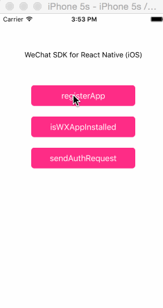

# react-native-wechat-ios
微信SDK集成示例，现已完成微信认证登录，分享链接，支付功能。

## 如何安装

#### 1. 下载包文件
```
$ npm i react-native-wechat-ios
```

#### 2. 链接库文件到你的项目中
参考 https://facebook.github.io/react-native/docs/linking-libraries-ios.html#content

a. 给RCTWeChat添加头文件搜索路径：`$(SRCROOT)/../../react-native/React`，并选择`recursive`。

b. 因为需要在 AppDelegate.m 文件中导入 RCTWeChat.h，所以需要在你的项目中添加一个头文件搜索路径：
`$(SRCROOT)/../node_modules/react-native-wechat-ios/RCTWeChat`，并选择`recursive`。


#### 3. 根据微信SDK文档需要做的一些设置
a. 根据微信SDK要求需要添加以下库文件
  - [x] SystemConfiguration.framework   
  - [x] libz.dylib
  - [x] libsqlite3.0.dylib
  - [x] libc++.dylib
  - [x] CoreTelephony.framework

Xcode7 可能找不到`*.dylib`库，可以选择`*.tbd`库，也可以参考这里
http://www.jianshu.com/p/1f575e4d1033

b. 在Xcode中，选择你的工程设置项，选中“TARGETS”一栏，在“info”标签栏的“URL type“添加“URL scheme”为你所注册的应用程序id


#### 4. 将刚添加的 scheme `weixin` 添加到 Info.plist 的 LSApplicationQueriesSchemes 中
近期苹果公司iOS 9系统策略更新，限制了http协议的访问，此外应用需要在“Info.plist”中将要使用的URL Schemes列为白名单，才可正常检查其他应用是否安装。
参考：
* http://www.jianshu.com/p/e38a609f786e. 
* http://www.bitscn.com/weixin/570774.html

## 如何使用

### 1. 重写AppDelegate的handleOpenURL和openURL方法：

需要导入`RCTWeChat.h`
```objective-c
#import "RCTWeChat.h"
```

```objective-c
- (BOOL)application:(UIApplication *)application handleOpenURL:(NSURL *)url
{
  return [[RCTWeChat shareInstance] handleOpenURL: url];
}

- (BOOL)application:(UIApplication *)application openURL:(NSURL *)url sourceApplication:(NSString *)sourceApplication annotation:(id)annotation {
  
  return [[RCTWeChat shareInstance] handleOpenURL: url];
  
}

```

### 2. 订阅`didRecvAuthResponse`事件获取认证处理结果
认证成功后由Native端触发该事件，通知React Native端。

```javascript
import {NativeAppEventEmitter} from 'react-native';

NativeAppEventEmitter.addListener(
  'didRecvAuthResponse',
  (response) => AlertIOS.alert(JSON.stringify(response))
);

```
###### 返回值(response):
* `response.code`
* `response.state`
* `response.errCode`

### 3. 发起认证
```javascript
import WeChat from 'react-native-wechat-ios';

let scope = 'snsapi_userinfo';
let state = 'wechat_sdk_test'; 
WeChat.sendAuthReq(scope, state, (res) => {
    alert(res); // true or false
});
```

### 4. 分享链接内容给微信
```javascript
WeChat.sendLinkURL({
    link: 'https://www.qianlonglaile.com/web/activity/share?uid=d1NrTmtrdVNFNzVmelVCQitpaEZxZz09&date=1449818774&from=groupmessage&isappinstalled=0#!/',
    tagName: '钱隆',
    title: '哈哈哈哈哈哈',
    desc: '噢噢噢噢哦哦哦哦哦哦',
    thumbImage: 'https://dn-qianlonglaile.qbox.me/static/pcQianlong/images/buy_8e82463510d2c7988f6b16877c9a9e39.png',
    scene: 1
});
```
### 5. 分享本地图片给微信
```javascript
WeChat.sendImage({
    path: '/var/xxxx/xxxx', //本地图片位置,可以用react-native-fs获取
    tagName: '钱隆',
    title: '哈哈哈哈哈哈',
    desc: '噢噢噢噢哦哦哦哦哦哦',
    scene: 1
});
```
### 6. 微信支付
#### 1. 调用支付
```javascript
//建议请先完成 isWXAppInstalled 和 isWXAppSupportAPI 验证调用微信及微信支付可行性
//请仔细核对调起支付参数
let payOptions = {
    appId: '********',
    nonceStr: '940ba5be3fd642a0bd935546b23e1b5d',
    partnerId: '**********',
    prepayId: 'wx201604252333295472c2d8a40853064388',
    packageValue: 'Sign=WXPay',
    timeStamp: '1461598433',
    sign: 'D055ABFA6B1030273FEDBE8ECEBE1FC0'
    };
WeChat.weChatPay(payOptions,(res) => {
   //console.log(res);
});
```
#### 2. 订阅`finishedPay`事件获取调用支付结果
支付结束后由Native端触发该事件，通知React Native端。
* ref: https://facebook.github.io/react-native/docs/native-modules-ios.html#content
* 注册监听事件
```javascript
let subscription = NativeAppEventEmitter.addListener(
    'finishedPay',
    (res) => {
      if(res.errCode == 0) { //充值成功
        console.log('充值成功');
      } else if(res.errCode == -1) { //很多情况下是证书问题
        console.log('支付失败,请稍后尝试'); 
      } else if(res.errCode == -2) { //充值取消
        console.log("充值取消");
      }
    }
  );
```
* 卸载监听事件
```javascript
componentWillUnmount() {
    if (Platform.OS == 'ios') {
      if(subscription != undefined) {
        subscription.remove();
      }
    }
  }
```
## 已完成的方法，`callback`都是可选的
- registerApp(appid, appdesc, callback)向微信注册应用ID, `appdesc`可选
```javascript
// 向微信注册应用ID
WeChat.registerApp('你的微信应用ID', (res) => {
    alert(res); // true or false
});
```
- isWXAppInstalled(callback) 检测是否已安装微信
```javascript
WeChat.isWXAppInstalled((res) => {
    alert('isWXAppInstalled: '+res); // true or false
});
```

- getWXAppInstallUrl(callback)获取微信的itunes安装地址

- isWXAppSupportApi(callback)判断当前微信的版本是否支持OpenApi

- getApiVersion(callback)获取当前微信SDK的版本号

- openWXApp(callback)打开微信客户端

- sendAuthReq(scope, state, callback) 发起认证请求
```javascript
let scope = 'snsapi_userinfo';
let state = 'wechat_sdk_test'; 
WeChat.sendAuthReq(scope, state, (res) => {
    alert(res); // true or false
});
```

- sendLinkURL(options, callback)分享链接内容给微信
options选项：
    * link：待分享的链接
    * tagName 标签
    * title 标题
    * desc 描述内容
    * thumbImage 缩略图地址
    * scene 场景(0:聊天界面，1:朋友圈，2:收藏)

- wechatPay(payOptions, callback)分享链接内容给微信
payOptions：
    * appId：应用ID
    * nonceStr 随机字符串
    * partnerId 商户号
    * prepayId 预支付交易会话ID
    * packageValue 扩展字段
    * timeStamp 时间戳
    * sign 签名
参考：
* https://pay.weixin.qq.com/wiki/doc/api/app/app.php?chapter=9_12&index=2 

## 事件，通过订阅事件获取操作结果
### didRecvAuthResponse
授权成功后触发

### didRecvMessageResponse 
分享成功后触发

### finishedPay 
调起支付成功后触发

## 更新日志
##### 2015.12.11
* 新增分享链接内容给微信
* 方法的回调函数变为可选的
* 新增WXApi方法，详见方法列表
* `sendAuthRequest`方法改为`sendAuthReq`
* 事件名`finishedAuth`改为`didRecvAuthResponse`

##### 2016.4.25
* 新增微信支付

## Example
记得要将 AppDelegate.m 文件中的IP换成自己的:

```Objective-c
jsCodeLocation = [NSURL URLWithString:@"http://172.16.5.70:8081/index.ios.bundle?platform=ios&dev=true"];
```



